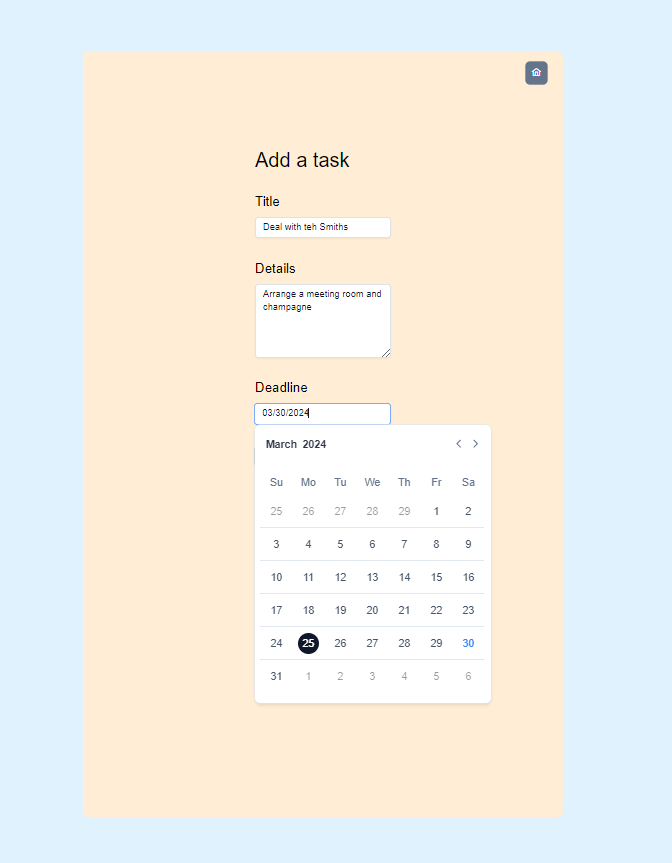
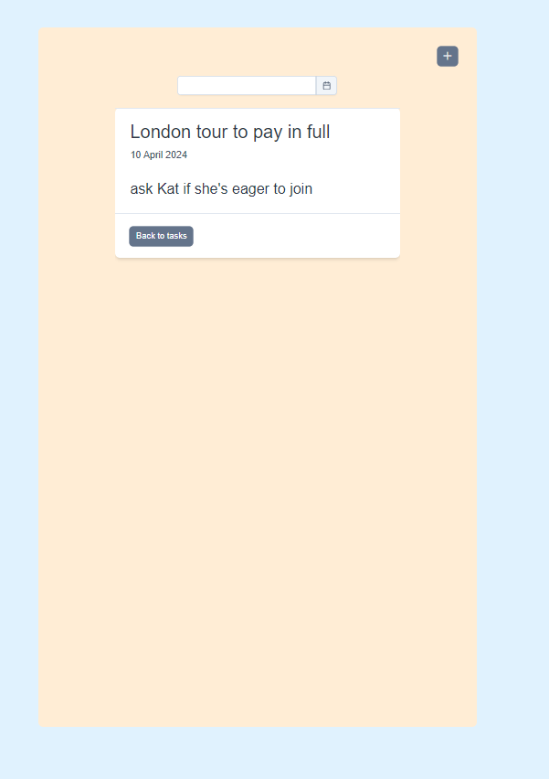
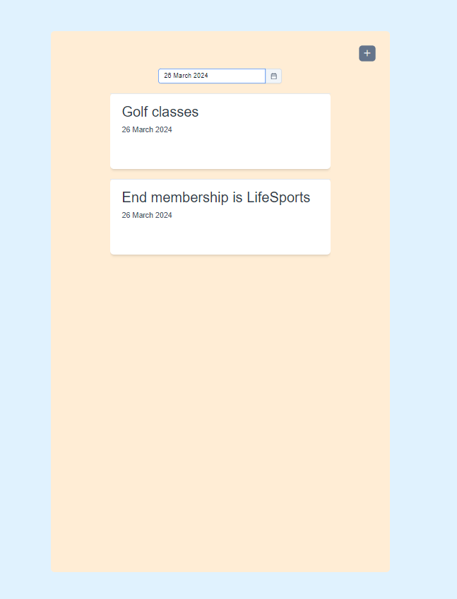

### Ru:

````markdown
# The Planner / Ежедневник

Ежедневник позволит вам сохранять и удалять задачи на конкретную дату, есть возможность отфильтровать задачи по дате. Чтобы посмотреть детали достаточно кликнуть на нее. Этот проект на Vue 3 Options + Vite + PrimeVue Tailwind создан для демонстрации знаний и умений в области современных технологий фронтенд-разработки, с акцентом на использовании эффективной архитектуры, паттернов проектирования и передовых возможностей Vue.js 3, Vuex и Vue Router. Проект иллюстрирует глубокое понимание реактивности в Vue, управления состоянием приложения с Vuex, а также гибкой и мощной системы маршрутизации с Vue Router.

## Особенности

- Все компоненты выполнены с помощью последней версии любимой UI библиотеки автора PrimeVue Tailwind.
- Для проекта выбрала Options API Vue 3 потому что я его люблю больше, чем Composition API.
- Для безконфликтной работы с библиотеками я выбираю Vite, и он действительно быстрый!
- Поскольку у нас два маршрута использую Vue Router для маршрутизации SPA.
- Управление состоянием через стейт-менеджер Vuex.
- Задачи хранятся на клиенте на localStorage.

Текст с самим тестовым задании сохранен в pdf файле в корне проекта

## Начало работы

### Предварительные требования

- Node.js версии 12.x или выше
- npm/yarn

### Установка

1. Клонируйте репозиторий:

```bash
git clone https://github.com/your-username/your-project-name.git
```

2. Установите зависимости:

cd your-project-name
npm install # Или yarn install
````

3. Запустите сервер разработки

npm run dev # Или yarn dev

Перейдите по адресу http://localhost:3000, чтобы просмотреть приложение.





# The Planner

The Planner allows you to save and delete tasks for specific dates, with the ability to filter tasks by date. To view details, simply click on it. This project, built with Vue 3 Options API, Vite, and PrimeVue Tailwind, demonstrates knowledge and skills in modern frontend technologies, focusing on effective architecture, design patterns, and advanced features of Vue.js 3, Vuex, and Vue Router. It illustrates a deep understanding of reactivity in Vue, state management in applications using Vuex, and a flexible and powerful routing system with Vue Router.

## Features

- All components are made using the latest version of the author's favorite UI library, PrimeVue Tailwind.
- Chose Vue 3's Options API for the project because I prefer it over the Composition API.
- For seamless library integration, I choose Vite, and it's indeed fast!
- As we have two routes, I use Vue Router for SPA routing.
- State management through Vuex state manager.

## Getting Started

### Prerequisites

- Node.js version 12.x or above
- npm/yarn

### Installation

1. Clone the repository:

```bash
git clone https://github.com/your-username/your-project-name.git
```

1. Install dependencies:

cd your-project-name
npm install # Or yarn install

2. Start the development server:

npm run dev # Or yarn dev

Navigate to http://localhost:3000 to view the application.
